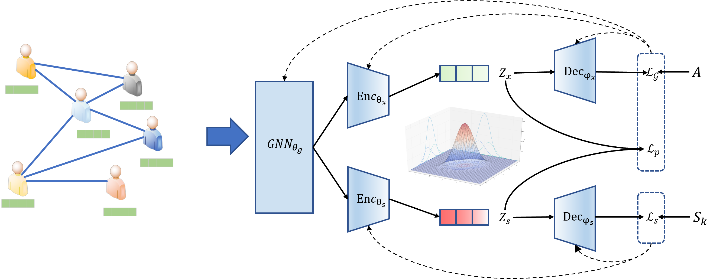

# PrivateGraphEncoder
Source Code for CIKM2023 paper "Independent Distribution Regularization for Private Graph Embedding"

## Introduction
We propose an independent regularization for private graph representation learning to protect graph embeddings against attribute inference attacks. The framework learns two graph autoencoders and forces the independence constraint.



## Reproduction

### Package Dependencies

* numpy
* pandas
* scipy
* scikit-learn == 1.1.2
* torch >= 1.12
* dgl == 0.9.0

### Data Preparation

Please download the dataset used at [Onedrive](https://hkustconnect-my.sharepoint.com/:u:/g/personal/qhuaf_connect_ust_hk/EYbgrMZX3-hGpTltvE6A7xcBt059Scv8a5OBfvwLun1JDA?e=qYEPok).

Unzip the file and put it under the root directory of this project.

### Train PVGAE

PVGAE sample usage at Credit defaulter dataset:

```bash
python main.py --model VGAEPrivacy --dataset credit --epoch 500 --local_epoch 1 --lr 0.005 --hidden1 64 --hidden2 32 --beta 1 --seed 1234 --use_pretrain False
```

APGE sample usage at Credit defaulter dataset:

```bash
python main_APGE.py --model APGE --dataset credit --lr 0.001 --epoch 500 --hidden1 64 --hidden2 32 --sead 1234 --use_pretrain False
``` 

### Citations
The details of this pipeline are described in the following paper. If you use this code in your work, please kindly cite it.

```bibtex
@inproceedings{hu2023independent,
  title={Independent Distribution Regularization for Private Graph Embedding},
  author={Hu, Qi and Song, Yangqiu},
  booktitle={Proceedings of the 32nd ACM International Conference on Information and Knowledge Management},
  pages={823--832},
  year={2023}
}
```

### Miscellaneous

Please send any questions about the code and/or the algorithm to <qhuaf@connect.ust.hk>.
